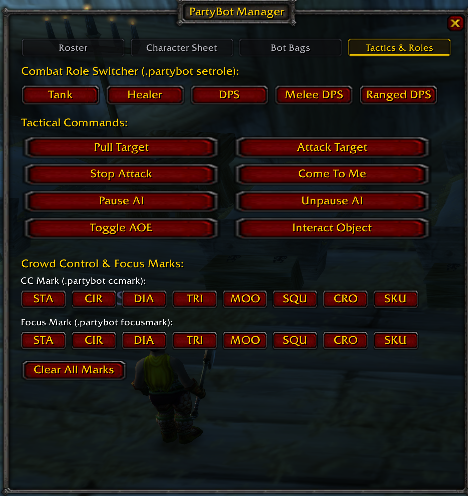

# PartyBotUI

PartyBotUI v1.4.3 is a World of Warcraft Vanilla 1.12.1 addon for servers running the vMaNGOS PartyBot companion system. It replaces routine `.partybot` chat commands with a Blizzard-style manager for summoning bots, inspecting characters and bags, and issuing tactical orders.

## Features

### Roster


- Manage up to four active PartyBots, jump directly to a bot's character sheet, or dismiss a bot.
- Discover account characters with `.partybot alts` and show up to nine characters in a 3x3 grid.
- Summon an account character with one click. Hover a character for level, race, class, and party status.
- Add generic role or class bots quickly: Tank, Healer, DPS, Warrior, Priest, Mage, Rogue, Druid, or Hunter.

### Character Sheet


- Switch among active bots and inspect each bot's level, race, class, health, power, 3D model, and 19 equipment slots.
- Right-click equipped items to move them to the bot's bags, or drag items from the player inventory onto an equipment slot.
- Open a trade directly with the selected bot or jump to that bot's bags.

### Bot Bags


- Inspect the selected bot's backpack and four equipped bags in one continuous grid of up to 88 slots.
- Left-click an item to retrieve it with `.partybot giveback`; the addon waits for server confirmation before clearing and refreshing the slot.
- Right-click an item to equip it on the selected bot.
- Upgrade one of the bot's four bag slots by dragging an empty, larger player bag onto it, or by selecting an eligible bag in the bot inventory and then choosing the destination slot.
- View the bot wallet, deposit 1g or 5g, or retrieve all bot gold.

### Tactics & Roles



- Set Tank, Healer, DPS, Melee DPS, or Ranged DPS roles.
- Pull or attack the current target, stop attacks, regroup bots, pause or resume AI, toggle AOE, and interact with a targeted game object.
- Assign raid-target icons for crowd control and focus fire, or clear all bot marks.
- Use the compact floating dock for Pull, Attack, Stop, Regroup, AOE, and quick access to the manager.

### Chat Filtering

PartyBotUI consumes its structured `[PB_*]` data messages and suppresses successful command output for five seconds after an addon-issued PartyBot command. Errors remain visible, including failed commands, invalid requests, full bags, and cannot-equip messages.

## Installation

1. Download the latest [`PartyBotUI.zip`](https://github.com/n2gb/partybotui/releases/latest/download/PartyBotUI.zip).
2. Extract it into the World of Warcraft addon directory so the final path is:

   ```text
   World of Warcraft\Interface\AddOns\PartyBotUI\
   ```

3. Launch World of Warcraft, or run `/console reloadui` if it is already open.
4. Enable PartyBotUI in the character-selection AddOns menu.

## Slash Commands

| Command | Action |
| --- | --- |
| `/pb` or `/partybot` | Toggle the PartyBot Manager |
| `/pb dock` | Show or hide the floating tactical dock |
| `/pb pull` | Order the Tank bot to pull the current target |
| `/pb atk` or `/pb attack` | Order all bots to attack the current target |
| `/pb stop` | Order all bots to stop attacking |
| `/pb follow` or `/pb regrp` | Call bots to the player's coordinates |
| `/pb aoe` | Toggle bot AOE spells |
| `/pb bags` | Query the targeted bot's bags |

## Compatibility

- Client: World of Warcraft Vanilla 1.12.1 (build 5875)
- Server: vMaNGOS with the PartyBot system and PartyBotUI server messages/commands

## Release

The addon version is 1.4.3. See [CHANGELOG.md](CHANGELOG.md) for its release history.
